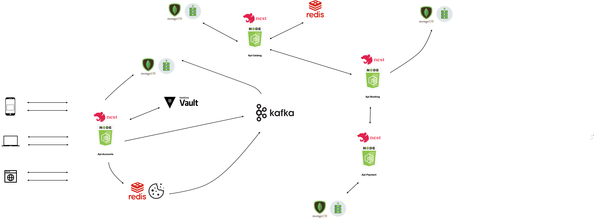

# Cinema Microservice

This project consists of 4 microservices:

- [cinema-account-microservice](https://github.com/leoan96/cinema-account-microservice)
- [cinema-catalog-microservice](https://github.com/leoan96/cinema-catalog-microservice)
- [cinema-booking-microservice](https://github.com/leoan96/cinema-booking-microservice)
- [cinema-payment-microservice](https://github.com/leoan96/cinema-payment-microservice)

### Clients

1. Clients would first send a http REST request to cinema-account-microservice to login.
2. If a valid login credential is provided, the session cookie is stored in redis and also returned to the client. User information is then attached to session stored in redis (only session id is returned to client).
3. The client would send the session cookie every time they send a request to the APIs.

### API Server

Each cinema microservice has common NestJS modules:

- Guard: For authenticating and authorizing user roles.
- Filter: Error handling for general errors and MongoDB errors, unknown errors are automatically filtered and logged while a generic internal server error with status code 500 would be returned to user.
- Pipe: Basic data validation.
- Logger: Custom logger (TODO: use winston transporter to log to 3rd party log manager)
- Interceptor: Intercept request and response, log them for debuging during production

1. [cinema-account-microservice](https://github.com/leoan96/cinema-account-microservice)

- Responsible for registration, login, logout, and actions associated with accounts.
- Environment variables are retrieved in 2 ways (initially using NestJS ConfigModule, later on Hashicorp Vault is used on a trial basis).
- Has its own MongoDB Atlas database (accounts db)
- Upon a valid login by user, the session and its associated information would be stored in redis (has a ttl/time to live duration) and also stored to the MongoDB database.
- ioredis package is used to listen for the redis session expiry. Upon expiry, a message would be publish as a kafka topic to [CloudKarafka](https://www.cloudkarafka.com/) kafka cluster.
- Another service would be subscribed to the kafka topic and upon receiving the message, it would delete the redis session id in the MongoDB database.

2. [cinema-catalog-microservice](https://github.com/leoan96/cinema-catalog-microservice)

- Responsible for movie listing, cinema availability, movie primieres, and etc...
- Has its own MongoDB Atlas database
- Redis is used to cache database query.

3. [cinema-booking-microservice](https://github.com/leoan96/cinema-booking-microservice)

- Responsible for booking movie tickets, showing booking ticket, and etc...
- Has its own MongoDB Atlas database
- Will utilize a client sdk (generated by openapi-generator) to call [cinema-payment-microservice](https://github.com/leoan96/cinema-payment-microservice) along with a JWT token as authentication for inter microservice communication.

4. [cinema-payment-microservice](https://github.com/leoan96/cinema-payment-microservice)

- Responsible for payment of tickets
- Has its own MongoDB Atlas database

## Overview Diagram

## Getting Started

These instructions will get you a copy of the project up and running on your local machine for development and testing purposes. See deployment for notes on how to deploy the project on a live system.

### Prerequisites

- [Docker](https://www.docker.com/products/docker-desktop)
- [HashicorpVault](https://www.vaultproject.io/)
- [CloudKarafka](https://www.cloudkarafka.com/)
- [Redis](https://redislabs.com/)
- [MongoDBAtlas](https://www.mongodb.com/cloud/atlas)
- [OpenApiGenerator](https://openapi-generator.tech/)

### Installing

Refer to each microservice repository for more information:

- [cinema-account-microservice](https://github.com/leoan96/cinema-account-microservice)
- [cinema-catalog-microservice](https://github.com/leoan96/cinema-catalog-microservice)
- [cinema-booking-microservice](https://github.com/leoan96/cinema-booking-microservice)
- [cinema-payment-microservice](https://github.com/leoan96/cinema-payment-microservice)

## Built With

- [ExpressJS](https://expressjs.com/) - Minimal and flexible Node.js web application framework
- [NestJS](https://nestjs.com/) - A progressive Node.js framework for building efficient, reliable and scalable server-side applications.
- [MongoDB](https://www.mongodb.com/) - Stores user data
- [Mongoose](https://mongoosejs.com/) - MongoDB validation, casting and business logic
- [Redis](https://redislabs.com/) - Real‑time data platform
- [HashicorpVault](https://www.vaultproject.io/) - Vault secures, stores, and tightly controls access to tokens, passwords, certificates, API keys, and other secrets in modern computing.
- [Kafka](https://www.cloudkarafka.com/) - Event Streaming Platform

## Authors

- **Loh Mun Kit** - _Initial work_ - [leoan96](https://github.com/leoan96)

## License

This project is licensed under the MIT License

## Acknowledgments

Inspired by

- https://medium.com/@cramirez92/build-a-nodejs-cinema-microservice-and-deploying-it-with-docker-part-1-7e28e25bfa8b
